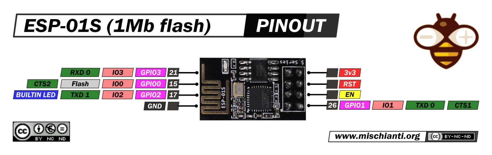

# ESP01S ESP8285 DHT11 MQTT

Project PlatformIO untuk membaca suhu dan kelembapan dari sensor DHT11 menggunakan modul ESP-01S/ESP8285, lalu mengirimkan data ke broker MQTT melalui koneksi TLS.

## Fitur

- Membaca suhu dan kelembapan dari DHT11.
- Menggunakan WiFi ESP8266/ESP8285.
- Publish data ke MQTT dengan `WiFiClientSecureBearSSL`.
- Topic MQTT terpisah untuk suhu dan kelembapan.
- Payload dipublish dengan flag retained.
- Konfigurasi WiFi, MQTT, dan CA certificate dipisahkan dari source code.

## Struktur Project

```text
.
├── assets/
│   └── esp-01s-esp8266-pinout-mischianti-low-res.jpg
├── SuhuKelembapanMQTT/
│   ├── platformio.ini
│   └── src/
│       ├── config.example.h
│       └── main.cpp
└── README.md
```

## Hardware

- ESP-01S / ESP8285
- Sensor DHT11
- USB to TTL adapter untuk upload firmware
- Power supply 3.3V yang stabil
- Resistor pull-up data DHT11 jika modul sensor tidak menyediakannya

## Wiring

Kode menggunakan pin berikut:



| ESP-01S / ESP8285 | DHT11 |
| --- | --- |
| 3.3V | VCC |
| GND | GND |
| GPIO2 | DATA |

Gambar di atas menunjukkan pinout ESP-01S/ESP8266 sebagai referensi saat menghubungkan sensor dan saat masuk ke mode flashing.

Catatan:

- ESP-01S bekerja pada 3.3V. Jangan hubungkan langsung ke logika 5V.
- Untuk mode flashing, biasanya GPIO0 perlu ditarik ke GND saat reset/power on.
- Pastikan CH_PD/EN ditarik ke 3.3V agar modul aktif.

## Persiapan Software

Install PlatformIO, bisa melalui:

- PlatformIO extension di Visual Studio Code
- PlatformIO Core CLI

Library yang digunakan sudah didefinisikan di `SuhuKelembapanMQTT/platformio.ini`:

- `adafruit/DHT sensor library`
- `knolleary/PubSubClient`

## Konfigurasi

Salin file contoh konfigurasi:

```powershell
Copy-Item SuhuKelembapanMQTT\src\config.example.h SuhuKelembapanMQTT\src\config.h
```

Lalu edit `SuhuKelembapanMQTT/src/config.h`:

```cpp
#define WIFI_SSID "nama_wifi"
#define WIFI_PASSWORD "password_wifi"

#define MQTT_SERVER "alamat_broker_mqtt"
#define MQTT_PORT "8883"
#define MQTT_USER "username_mqtt"
#define MQTT_PASS "password_mqtt"
#define MQTT_TOPIC_SUHU "rumah/sensor/suhu"
#define MQTT_TOPIC_KELEMBAPAN "rumah/sensor/kelembapan"
#define MQTT_CA_CERT R"EOF(
-----BEGIN CERTIFICATE-----
isi_ca_certificate
-----END CERTIFICATE-----
)EOF"
```

`config.h` berisi kredensial lokal dan sudah diabaikan oleh Git melalui `.gitignore`.

## Build

Jalankan dari folder project PlatformIO:

```powershell
cd SuhuKelembapanMQTT
platformio run
```

Atau dari root repository:

```powershell
platformio run -d SuhuKelembapanMQTT
```

## Upload Firmware

Hubungkan ESP-01S ke USB to TTL adapter, masuk ke mode flashing, lalu jalankan:

```powershell
cd SuhuKelembapanMQTT
platformio run --target upload
```

Jika perlu menentukan port serial:

```powershell
platformio run --target upload --upload-port COM3
```

Ganti `COM3` sesuai port yang terdeteksi di komputer.

## Serial Monitor

```powershell
cd SuhuKelembapanMQTT
platformio device monitor
```

Baud rate monitor dikonfigurasi pada `115200`.

## Topic MQTT

Default topic dari `config.example.h`:

| Data | Topic |
| --- | --- |
| Suhu | `rumah/sensor/suhu` |
| Kelembapan | `rumah/sensor/kelembapan` |

Payload berupa angka desimal dengan dua digit di belakang koma, contoh:

```text
29.50
68.00
```

## Cara Kerja

1. ESP terhubung ke WiFi menggunakan `WIFI_SSID` dan `WIFI_PASSWORD`.
2. CA certificate dari `MQTT_CA_CERT` dipasang sebagai trust anchor TLS.
3. Client MQTT terhubung ke `MQTT_SERVER` dan `MQTT_PORT`.
4. DHT11 dibaca setiap 5 detik.
5. Suhu dan kelembapan dipublish ke topic masing-masing.

## Troubleshooting

- Gagal connect WiFi: periksa SSID, password, jarak router, dan supply 3.3V.
- Gagal connect MQTT: periksa host, port, username, password, dan CA certificate.
- `Failed to read from DHT sensor`: periksa wiring DHT11, pin DATA ke GPIO2, dan pull-up resistor.
- Upload gagal: pastikan ESP masuk mode flashing, GPIO0 ke GND saat reset, dan port serial benar.
- Modul reset berulang: biasanya karena supply 3.3V tidak cukup stabil.

## Lisensi

Belum ada lisensi eksplisit di repository ini. Tambahkan file `LICENSE` jika project akan dipublikasikan atau dipakai ulang oleh pihak lain.
